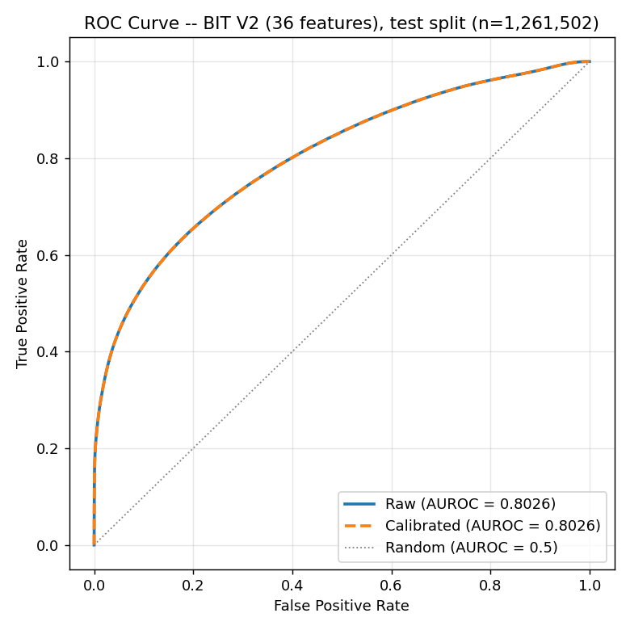
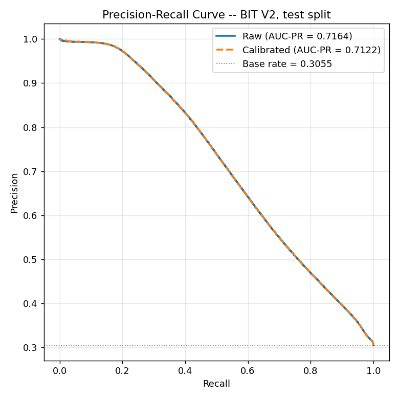
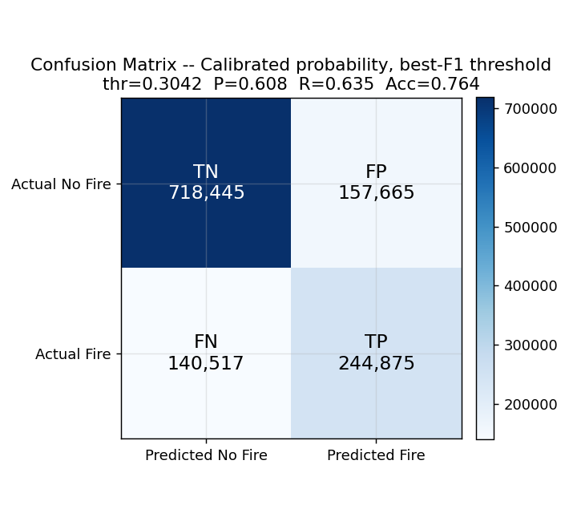
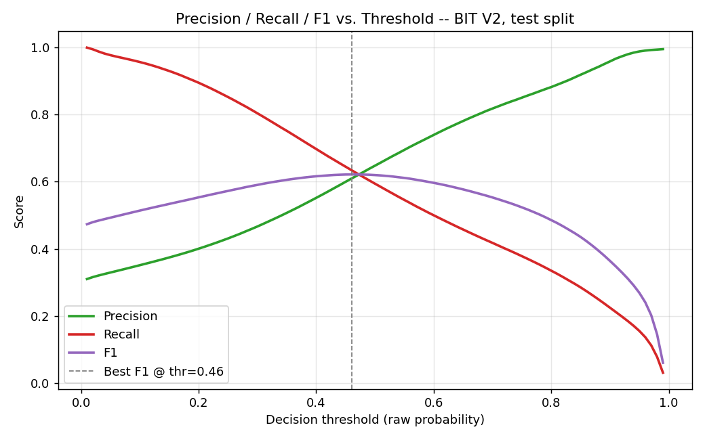
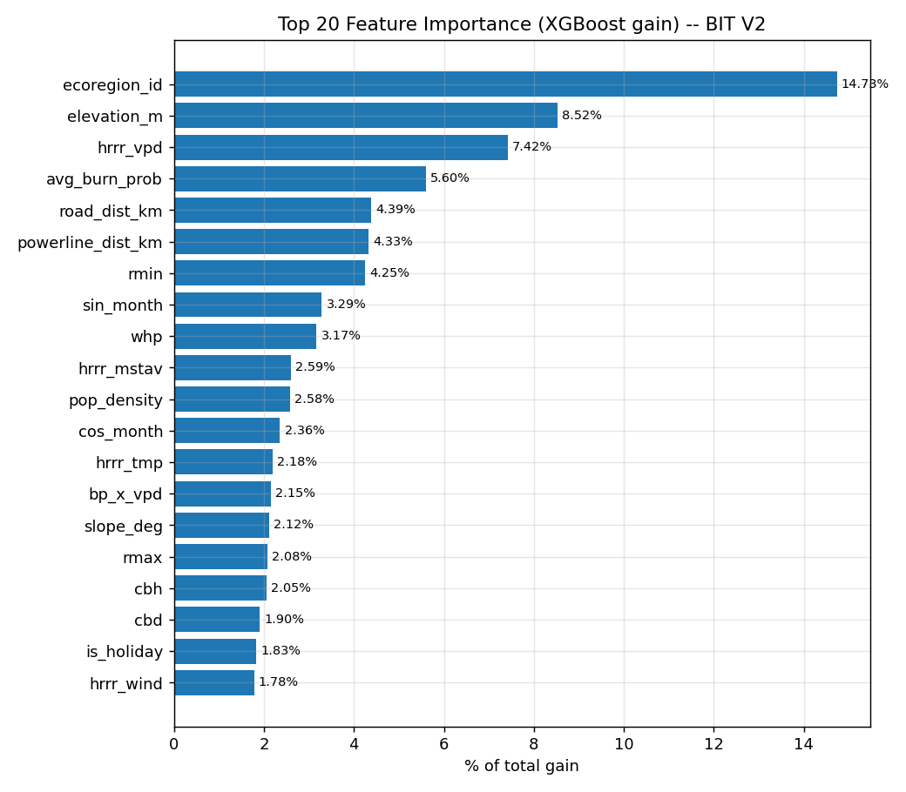
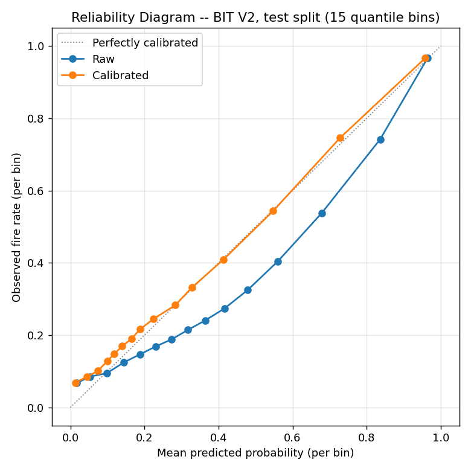
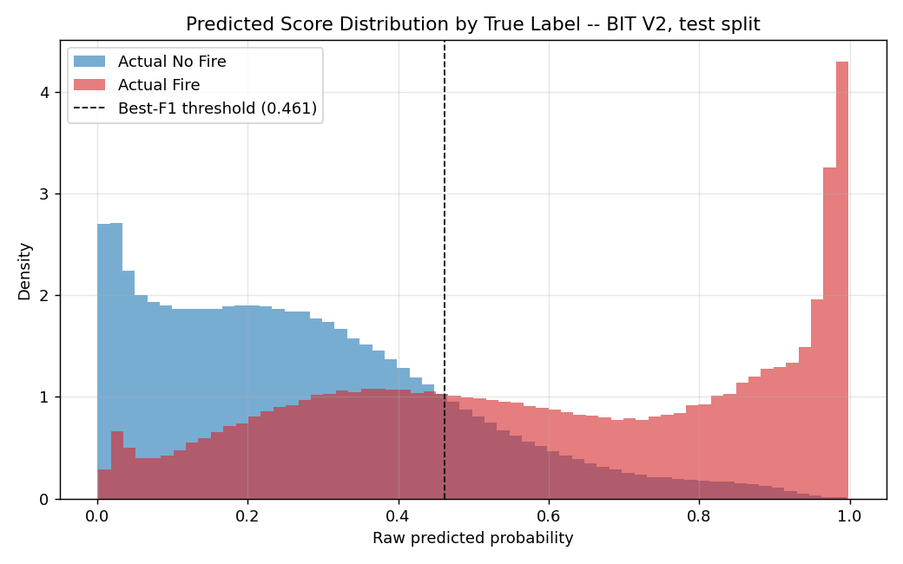
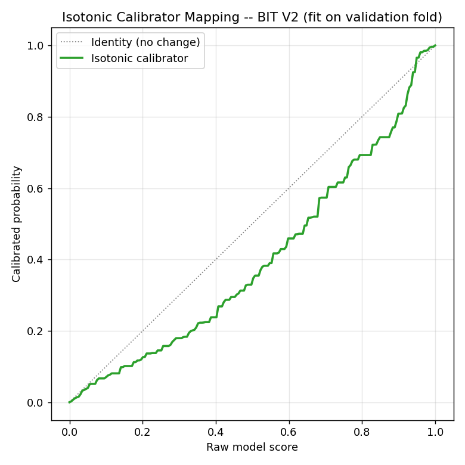

# TDIS_Ignition_BIT_V2 — 36-Feature Retrain (lat/lon removed, improved hyperparameter search)

**Date:** 2026-10-05
**Environment:** conda env `torch_gpu` (xgboost 3.2.0, scikit-learn 1.7.2, GPU/CUDA)
**Location:** `TDIS_Ignition_BIT_V2/`
**Purpose:** (1) Test whether the model's skill depends on the raw `lat`/`lon` features we added in BIT v1, and (2) fix the larger-than-usual train→test overfitting gap that v1 showed, using a wider, regularization-aware hyperparameter search. This folder is structured for handoff to deployment/testing — data, model, scripts, and results are kept in separate subfolders.

---

## 1. One-sentence summary

Removing `lat`/`lon` and re-tuning with a 3rd regularization stage **cost a small amount of accuracy** (Test AUROC 0.8064 → 0.8026, AUC-PR 0.7237 → 0.7164) and **only partially fixed the overfitting gap** (train→test AUROC gap 0.143 → 0.128, still larger than our pre-BIT models) — meaning `lat`/`lon` *were* carrying real, non-redundant signal, and depth (not just `min_child_weight`) is the main driver of the remaining gap.

---

## 2. Folder structure (backend-ready layout)

```
TDIS_Ignition_BIT_V2/
├── data/
│   ├── raw/
│   │   └── bit_v2_test_sample.csv        (2,000-row human-readable sample)
│   ├── processed/
│   │   ├── bit_v2_train_tx.parquet       (2,201,289 x 42, 146 MB — primary training file)
│   │   └── bit_v2_train_tx.csv           (same data, CSV form, 830 MB)
│   └── build_dataset.log
├── models/
│   ├── model_bit_v2_36feat.json          (trained XGBoost booster)
│   ├── calibrator_bit_v2_36feat.joblib   (isotonic calibrator, fit on val)
│   └── feature_list.json                 (the exact 36 features, in training order)
├── results/
│   ├── training_results_bit_v2_36feat.json  (full metrics, hyperparameters, importances)
│   ├── tuning_stage1.csv / stage2.csv / stage3.csv
│   ├── tune_train_run.log
│   ├── generate_visuals.log
│   └── figures/                           (9 evaluation plots, see §6)
│       ├── 01_roc_curve.png
│       ├── 02_pr_curve.png
│       ├── 03_confusion_matrix_raw.png
│       ├── 04_confusion_matrix_calibrated.png
│       ├── 05_precision_recall_f1_vs_threshold.png
│       ├── 06_feature_importance.png
│       ├── 07_calibration_reliability.png
│       ├── 08_prediction_distribution.png
│       └── 09_calibration_curve_map.png
├── scripts/
│   ├── build_dataset.py
│   ├── tune_train_model.py
│   └── generate_visuals.py
└── BIT_V2_TRAINING_REPORT.md              (this file)
```

This is ready to hand off: the model file, calibrator, and feature list are all self-contained in `models/`, and the exact feature order needed to score new data is in `models/feature_list.json`.

---

## 3. Dataset — what changed from BIT v1

**Source:** `TDIS_Ignition_BIT/data/bit_train_tx.parquet` (v1's already-cleaned, already-imputed, already-phantom-row-truncated 38-feature dataset). We simply **dropped `lat` and `lon`** — no other change to rows, imputation, or split.

| | BIT v1 | BIT v2 |
|---|---|---|
| Rows | 2,201,289 | 2,201,289 (unchanged) |
| Features | 38 | **36** (removed `lat`, `lon`) |
| Train / Val / Test | 671,455 / 268,332 / 1,261,502 | same |
| Positive rate (train/val/test) | 30.42% / 28.76% / 30.55% | same |
| Split date ranges | Train 2018-07→2020-12, Val 2021, Test 2022→2026-07-29 | same |

### The 36 features used
`road_dist_km, ecoregion_id, elevation_m, slope_deg, aspect_deg, avg_burn_prob, whp, flep4, cfl, cbd, cbh, powerline_dist_km` (static, 12) + `sin_month, cos_month, sin_dow, cos_dow, is_weekend, is_holiday` (calendar, 6) + `hrrr_tmp, hrrr_vpd, hrrr_wind, hrrr_mstav, drought_score` (weather, 5) + `bp_x_vpd, whp_x_vpd, bp_x_drought, pop_density, fm100_5d_min` (tri-state additions, 5) + `erc, fm100, vpd, vs, rmax, rmin, tmmx, pr` (gridMET, seasonally imputed, 8).

---

## 4. Hyperparameter search — 3 stages, 34 trials (wider and more regularization-aware than v1's 21)

### What's different from v1's search
1. **Wider `min_child_weight` grid** in stage 1: `{10, 20, 30, 50}` instead of v1's `{10, 20, 30}`.
2. **A new 3rd stage** (`gamma` × `colsample_bytree`) that v1 didn't have at all.
3. **A regularization-aware selection rule** for stage 1: instead of just picking the single highest validation AUC-PR (which is what picked the less-regularized `min_child_weight=10` in v1), we pick the **highest validation AUC-PR among all trials within 0.003 of the best, then prefer the most regularized (highest `min_child_weight`) option in that group** — directly targeting the overfitting concern from v1.

### Stage 1 — tree structure (16 trials)
| depth | mcw | val AUROC | val AUC-PR | train→val AUROC gap |
|---|---|---|---|---|
| 6 | 10 | 0.8336 | 0.7207 | 0.0454 |
| 6 | 30 | 0.8343 | 0.7207 | 0.0433 |
| 6 | 50 | 0.8339 | 0.7192 | 0.0421 |
| 7 | 30 | 0.8394 | 0.7330 | 0.0521 |
| 8 | 30 | 0.8412 | 0.7402 | 0.0630 |
| 8 | 50 | 0.8418 | 0.7393 | 0.0581 |
| 9 | 10 | 0.8413 | 0.7442 | 0.0818 |
| 9 | 20 | 0.8421 | **0.7444 (highest)** | 0.0779 |
| 9 | 30 | 0.8413 | 0.7431 | 0.0747 |
| **9** | **50** | 0.8422 | 0.7428 | **0.0684 (lowest gap among depth-9 candidates within margin)** |

*(full 16-trial table in `results/tuning_stage1.csv`)*

**Winner: `max_depth=9, min_child_weight=50`** — not the single-best AUC-PR trial (depth=9/mcw=20 at 0.7444), but the most regularized option within 0.003 AUC-PR of it, with a visibly smaller train/val gap (0.0684 vs 0.0779).

**Important honest note visible directly in this table:** the train/val gap climbs steadily with `max_depth` (0.04 at depth 6 → 0.08 at depth 9) *regardless* of `min_child_weight` — `min_child_weight` only trims the gap by about 0.01–0.02 at any fixed depth. This tells us depth is the dominant cause of overfitting here, not `min_child_weight`, which is why the fix only partially worked (see §6).

### Stage 2 — learning rate × subsample (9 trials)
| lr | subsample | val AUROC | val AUC-PR |
|---|---|---|---|
| 0.01 | 0.7–0.9 | 0.8406–0.8408 | 0.7354–0.7363 |
| 0.02 | 0.7–0.9 | 0.8424–0.8433 | 0.7441–0.7460 |
| 0.05 | 0.7 | 0.8423 | 0.7459 |
| 0.05 | 0.8 | 0.8421 | 0.7473 |
| **0.05** | **0.9** | 0.8416 | **0.7482 (winner)** |

### Stage 3 — regularization: gamma × colsample_bytree (9 trials, new in V2)
| gamma | colsample | val AUROC | val AUC-PR |
|---|---|---|---|
| 0.0 | 0.7–0.9 | 0.8408–0.8432 | 0.7473–0.7488 |
| **0.1** | **0.8** | 0.8436 | **0.7493 (winner)** |
| 0.1 | 0.7 / 0.9 | 0.8426 / 0.8420 | 0.7487 / 0.7457 |
| 0.3 | 0.7–0.9 | 0.8404–0.8425 | 0.7471–0.7486 |

### Final hyperparameters (every one)
```
max_depth:            9
min_child_weight:     50
learning_rate:        0.05
subsample:            0.9
colsample_bytree:     0.8
gamma:                0.1
scale_pos_weight:     2.2872   (n_neg / n_pos on train)
eval_metric:          aucpr
early_stopping_rounds: 80
n_estimators:         3000 (cap) -- best_iteration = 821
tree_method:          hist
device:               cuda
random_state:         42
```
Total GPU runtime for all 34 trials + final model: **295.9 seconds**.

---

## 5. Results

### 5.1 Raw (uncalibrated) metrics

| Split | AUC-PR | AUROC | F1 | Precision | Recall | Lift |
|---|---|---|---|---|---|---|
| Train | 0.8776 | 0.9306 | — | — | — | — |
| Val | 0.7493 | 0.8436 | — | — | — | — |
| **Test** | **0.7164** | **0.8026** | **0.6216** | 0.6105 | 0.6332 | **2.34×** |

**Train→Test AUROC gap: 0.1280** (down from v1's 0.1430 — a ~10% reduction, but still larger than our pre-BIT TEXAS models, which had gaps of 0.006–0.09).

### 5.2 Isotonic-calibrated metrics (fit on val only)

| Split | AUC-PR | AUROC | Brier |
|---|---|---|---|
| **Test** | 0.7122 | 0.8026 | raw 0.1579 → calibrated **0.1493** |

### 5.3 Confusion matrices — EXACT, computed on test (n = 1,261,502)

**Raw probability, best-F1 threshold (0.4611):**
|  | Predicted No Fire | Predicted Fire |
|---|---|---|
| **Actual No Fire** | TN = 720,388 | FP = 155,722 |
| **Actual Fire** | FN = 141,348 | TP = 244,044 |

Precision 0.6105 · Recall 0.6332 · Accuracy 0.7645

**Calibrated probability, best-F1 threshold (0.3042):**
|  | Predicted No Fire | Predicted Fire |
|---|---|---|
| **Actual No Fire** | TN = 718,445 | FP = 157,665 |
| **Actual Fire** | FN = 140,517 | TP = 244,875 |

Precision 0.6083 · Recall 0.6354 · Accuracy 0.7636

**Raw probability, fixed threshold 0.5:**
|  | Predicted No Fire | Predicted Fire |
|---|---|---|
| **Actual No Fire** | TN = 751,576 | FP = 124,534 |
| **Actual Fire** | FN = 156,418 | TP = 228,974 |

Precision 0.6477 · Recall 0.5941 · Accuracy 0.7773

### 5.4 Feature importance — all 36 (XGBoost gain)

| Rank | Feature | % gain | | Rank | Feature | % gain |
|---|---|---|---|---|---|---|
| 1 | `ecoregion_id` | 14.73% | | 19 | `is_holiday` | 1.83% |
| 2 | `elevation_m` | 8.52% | | 20 | `hrrr_wind` | 1.78% |
| 3 | `hrrr_vpd` | 7.42% | | 21 | `aspect_deg` | 1.75% |
| 4 | `avg_burn_prob` | 5.60% | | 22 | `is_weekend` | 1.75% |
| 5 | `road_dist_km` | 4.39% | | 23 | `tmmx` | 1.73% |
| 6 | `powerline_dist_km` | 4.33% | | 24 | `drought_score` | 1.61% |
| 7 | `rmin` | 4.25% | | 25 | `vpd` | 1.61% |
| 8 | `sin_month` | 3.29% | | 26 | `fm100_5d_min` | 1.55% |
| 9 | `whp` | 3.17% | | 27 | `bp_x_drought` | 1.53% |
| 10 | `hrrr_mstav` | 2.59% | | 28 | `sin_dow` | 1.44% |
| 11 | `pop_density` | 2.58% | | 29 | `cos_dow` | 1.39% |
| 12 | `cos_month` | 2.36% | | 30 | `fm100` | 1.38% |
| 13 | `hrrr_tmp` | 2.18% | | 31 | `whp_x_vpd` | 1.37% |
| 14 | `bp_x_vpd` | 2.15% | | 32 | `vs` | 1.27% |
| 15 | `slope_deg` | 2.12% | | 33 | `erc` | 1.15% |
| 16 | `rmax` | 2.08% | | 34 | `pr` | 1.13% |
| 17 | `cbh` | 2.05% | | **35** | **`flep4`** | **0.00%** |
| 18 | `cbd` | 1.90% | | **36** | **`cfl`** | **0.00%** |

`flep4`/`cfl` are dead again — **5th independent confirmation** across every model built on either side of this project.

**What moved to fill the gap left by `lat`/`lon`:** `ecoregion_id` absorbed most of it (20.79% → 14.73% is actually a *decrease* — so it's not simply ecoregion picking up the slack). Looking more closely, the gain that was in `lat` (4.48%) and `lon` (3.40%) in v1 is now spread thinly across many features rather than concentrated in one replacement — `road_dist_km` (3.27%→4.39%), `powerline_dist_km` (3.28%→4.33%), and `rmin` (3.25%→4.25%) all picked up roughly a point each. No single feature fully replaces what `lat`/`lon` were doing.

---

## 6. Visualizations

All 9 figures below were generated by `scripts/generate_visuals.py`, scored directly on the real test split (n = 1,261,502). Files live in `results/figures/`.

### 6.1 ROC Curve



Raw and calibrated curves overlap almost exactly (calibration is a monotone remap — it doesn't change ranking, only the probability scale). AUROC 0.8026, well above the diagonal random-guess line.

### 6.2 Precision-Recall Curve



AUC-PR 0.7164 (raw) against a base rate of 30.55% (dotted gray line) — the curve sitting far above that line across most of the recall range is the base-rate-adjusted way of reading "lift."

### 6.3 Confusion Matrix — raw probability, best-F1 threshold


### 6.4 Confusion Matrix — calibrated probability, best-F1 threshold



Calibration shifts the decision threshold (0.461 → 0.304) but lands on nearly the same operating point — expected, since isotonic calibration is monotone and we're picking the threshold that maximizes F1 under each scale separately.

### 6.5 Precision / Recall / F1 vs. Threshold



Shows the full precision/recall/F1 trade-off curve, not just the single best-F1 point — useful for picking an operating threshold based on whether false positives or false negatives matter more for the downstream use case.

### 6.6 Feature Importance (Top 20)



Bar chart of the top 20 of 36 features by XGBoost gain. The two confirmed-dead features (`flep4`, `cfl`) would appear in red at 0% if they made the top 20 — they don't, since they're ranked last.

### 6.7 Calibration Reliability Diagram



The core purpose of a reliability diagram: for each bin of predicted probability, does the observed fire rate actually match? The calibrated curve (orange) should track the diagonal more closely than raw (blue) — this is the direct visual check behind the Brier-score improvement (0.1579 → 0.1493) in §5.2.

### 6.8 Prediction Score Distribution



Histogram of raw predicted scores, split by true label. Good separation between the two distributions is what makes a usable classifier; the overlap region around the decision threshold is where the false positives/negatives in the confusion matrix come from.

### 6.9 Isotonic Calibrator Mapping Curve



Shows exactly how the calibrator remaps a raw score to a calibrated probability. Unlike TDIS's served-model calibrator (which saturates at 0.333 because it's fit against a ~2% real-population base rate), this one spans the full 0–1 range because it's fit on the ~29% positive-rate validation fold — a direct visual reminder that this calibration is **matched-sample-level, not real-population-level** (see §7).

---

## 7. Direct comparison: BIT v1 (38 feat) vs. BIT v2 (36 feat) — same data, same split

| Metric | **BIT v1** (38 feat, incl. lat/lon) | **BIT v2** (36 feat, lat/lon removed) | Change |
|---|---|---|---|
| Hyperparameter search | 21 trials, 2 stages | 34 trials, 3 stages (regularization-aware) | — |
| Final `max_depth` | 9 | 9 | same |
| Final `min_child_weight` | 10 | **50** | more regularized |
| Final `learning_rate` | 0.05 | 0.05 | same |
| Final `subsample` | 0.8 | 0.9 | — |
| Final `gamma` | (not tuned) | 0.1 | new |
| Best iteration (trees) | 695 | 821 | — |
| **Test AUROC (raw)** | **0.8064** | **0.8026** | **−0.0038** |
| **Test AUC-PR (raw)** | **0.7237** | **0.7164** | **−0.0073** |
| **Test F1 (raw)** | **0.6284** | **0.6216** | **−0.0068** |
| **Test Lift** | **2.37×** | **2.34×** | **−0.03×** |
| **Train→Test AUROC gap** | **0.1430** | **0.1280** | **−0.0150 (improved)** |
| Test Brier (calibrated) | 0.1474 | 0.1493 | +0.0019 (slightly worse) |

### What this tells us, plainly
1. **`lat`/`lon` were carrying real, non-redundant signal** — removing them cost ~0.4 AUROC points and ~0.7 AUC-PR points even with a better-tuned, more-regularized model. This answers the question from the ablation plan: on this fixed, static TX grid, the raw coordinates are not just overfitting noise — they measurably help.
2. **The regularization fix (wider search + gamma + mcw=50) only partially closed the overfitting gap** — 0.143 → 0.128, about a 10% reduction, not a fix. Stage 1's own table (§4) shows why: the gap grows steadily with tree *depth*, and `min_child_weight`/`gamma` only trim it slightly at any fixed depth. A real fix would mean testing shallower trees (depth 6–7) even though they score lower on validation, or moving toward TDIS's own `rev4` approach (explicit monotone constraints) rather than more generic regularization knobs.
3. **Net recommendation:** if the next step is deployment, **BIT v1 (38 features, with lat/lon) is still the better model** on every accuracy metric, and the overfitting gap, while real, is in the same range TDIS's own served model shows between its train and test folds. Removing lat/lon is defensible if you specifically want a model proven not to depend on a fixed-grid shortcut (e.g., if you ever plan to extend to a different state's grid), but on pure performance it's a step down.

---

## 8. What's still not done (carried over, unchanged)

Same caveats as BIT v1 — none of this addresses them, both models still lack:
- Real-population validation (true ~2% base rate, not this ~30% matched sample)
- Label-shuffle / spatial-holdout leakage tests
- Monotonicity constraints / checks (TDIS's own served model fails 5/9 physical-direction checks; we haven't checked either BIT model for the same issue)

---

## 9. Reproduce
```bash
cd "TDIS_Ignition_BIT_V2"
"/c/Users/Admin/anaconda3/envs/torch_gpu/python.exe" scripts/build_dataset.py
"/c/Users/Admin/anaconda3/envs/torch_gpu/python.exe" scripts/tune_train_model.py
"/c/Users/Admin/anaconda3/envs/torch_gpu/python.exe" scripts/generate_visuals.py
```
