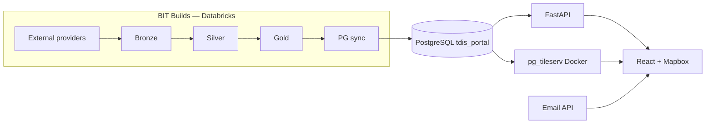
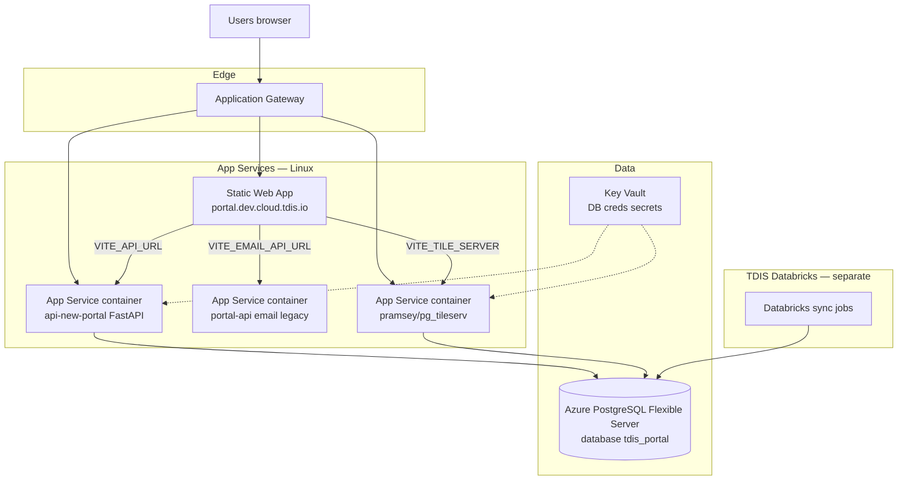
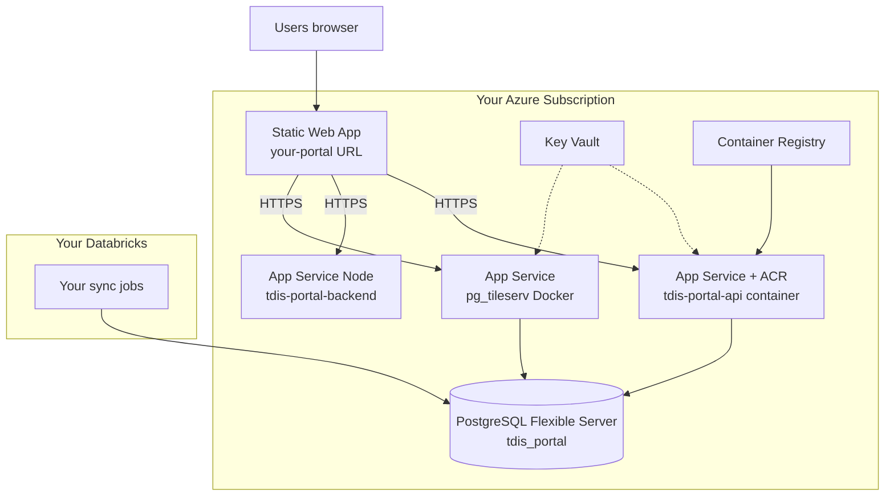
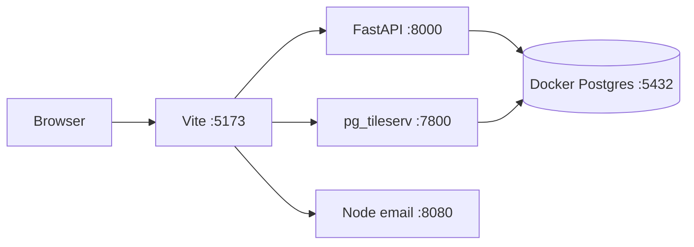

# 02 — Deployment Architecture

This chapter shows **how TDIS deploys the portal today** (reference) and **how you deploy the same logical stack on your Azure subscription**.

Code repos are **sent separately** — see [REPOS.md](../REPOS.md).

---

## Repos you will receive (code — separate delivery)

| Repository | Branch | Deployed as |
|------------|--------|-------------|
| **tdis-portal-frontend** | `development` | Static Web App (React build) |
| **tdis-portal-api** | `develop` | App Service — Linux container (FastAPI) |
| **tdis-portal-backend** | `development` | App Service — Node (Contact Us email) |
| **tdis-portal-db** | `development` | Not a runtime — SQL migrations / schema reference |

Pinned commits: [CODE_SNAPSHOTS.md](../CODE_SNAPSHOTS.md)

**Not sent:** TDIS Azure infra repos, Keycloak, TDIS AI, production data.

---

## Data flow (both environments)

Your Databricks jobs populate PostgreSQL. Portal code only **reads** the database and serves the UI.

---

## How TDIS deploys it today (reference)

TDIS runs this in its own Azure subscription. You do **not** get access to this environment — use this as a **blueprint**.

| TDIS component | Azure resource | Hostname (dev example) |
|----------------|----------------|------------------------|
| Frontend | Static Web App | `portal.dev.cloud.tdis.io` |
| Portal API (FastAPI) | App Service + ACR | `api-new-portal.dev.cloud.tdis.io` |
| Email API | App Service + ACR | `api-portal.dev.cloud.tdis.io` |
| Map tiles | App Service + Docker Hub image | `portal-pgtile.dev.cloud.tdis.io` |
| Database | PostgreSQL Flexible Server | Key Vault secret — not public |
| Secrets | Key Vault | `tdis-dev-key-vault` |
| Ingress | Application Gateway | TLS + routing |
| Ingestion | Databricks → PostgreSQL | TDIS internal |

---

## How you deploy it (your Azure)

Same **logical** stack. You create resources manually (Portal or `az` CLI) — **no Terragrunt**.

| Your component | Azure resource | See chapter |
|----------------|----------------|-------------|
| Frontend | Static Web App | [08-deploy-to-azure-by-hand.md](08-deploy-to-azure-by-hand.md) §6 |
| FastAPI | App Service (Linux container) + ACR | §4–5 |
| Email | App Service (Node) | §8 |
| pg_tileserv | App Service — image `pramsey/pg_tileserv` | §7 |
| Database | PostgreSQL Flexible Server | §2 |
| Secrets | Key Vault | §3 |
| Ingestion | Your Databricks workspace + ADLS | [14-trd-reference.md](14-trd-reference.md) |

**Optional later:** Application Gateway for custom domain — not required to start.

---

## Local deployment (your laptop)

Same components, all on localhost — for development before Azure.

Step-by-step: [06-local-development.md](06-local-development.md)

---

## Local ↔ Azure ↔ TDIS mapping

| Role | Local | Your Azure | TDIS (reference) |
|------|-------|------------|------------------|
| Frontend | `:5173` | Static Web App | SWA + App Gateway |
| API | `:8000` | App Service + ACR | App Service `portal-api-new` |
| Email | `:8080` | App Service Node | App Service `portal-api` |
| Tiles | Docker `:7800` | App Service Docker | App Service `pg_tileserv` |
| Database | Docker Postgres | Flexible Server | Flexible Server + KV |
| Secrets | `.env` | Key Vault | Key Vault |

---

## API surface (FastAPI)

Base path: `/api/v1` — full list in TRD and OpenAPI at `/docs` when API runs locally.

Data-heavy endpoints need **Source B** PostgreSQL objects from your Databricks sync — see [07-postgresql-schema.md](07-postgresql-schema.md).
