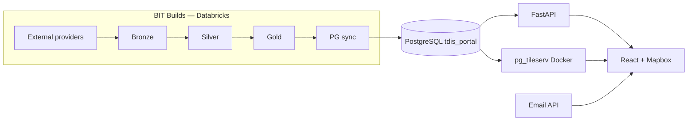
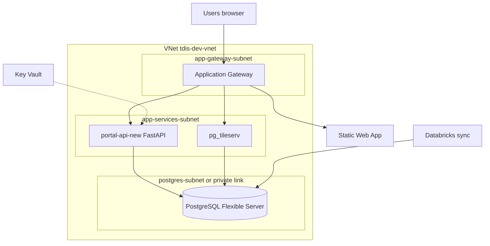
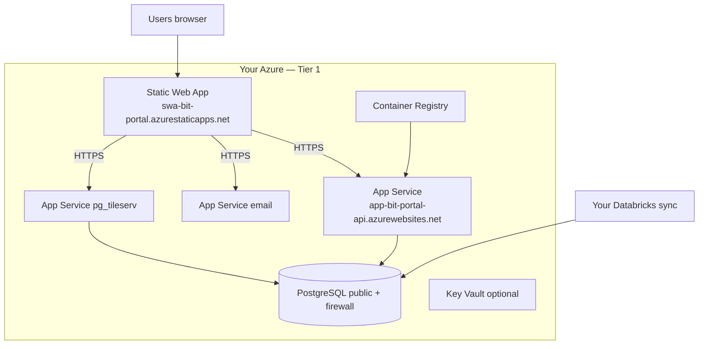
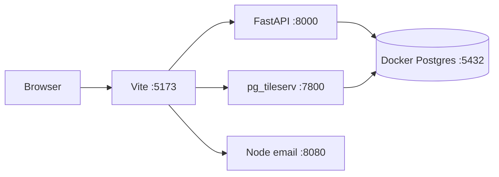

# 02 — Deployment Architecture

Three deployment models: **how TDIS runs production**, **how you deploy Tier 1 (first)**, and **local laptop**.

Code repos are **sent separately** — see [REPOS.md](../REPOS.md).

---

## Repos you will receive (code — separate delivery)

| Repository | Branch | Deployed as |
|------------|--------|-------------|
| **tdis-portal-frontend** | `development` | Static Web App (React build) |
| **tdis-portal-api** | `develop` | App Service — Linux container (FastAPI) |
| **tdis-portal-backend** | `development` | App Service — Node (Contact Us email) |
| **tdis-portal-db** | `development` | Not a runtime — SQL migrations / schema reference |

Pinned commits: [CODE_SNAPSHOTS.md](../CODE_SNAPSHOTS.md)

---

## Data flow (all environments)

---

## Diagram A — TDIS production (reference only)

TDIS uses **VNet, subnets, and Application Gateway**. You do **not** build this on day one.

| TDIS component | Azure resource | Hostname (dev example) |
|----------------|----------------|------------------------|
| Frontend | Static Web App | `portal.dev.cloud.tdis.io` |
| Portal API | App Service + ACR, VNet integrated | `api-new-portal.dev.cloud.tdis.io` |
| Map tiles | App Service Docker, VNet integrated | `portal-pgtile.dev.cloud.tdis.io` |
| Database | PostgreSQL (private) | Key Vault — not public |
| Ingress | Application Gateway | TLS + routing |
| Secrets | Key Vault + managed identity | `tdis-dev-key-vault` |

Full networking detail: [08c-azure-tier2-reference.md](08c-azure-tier2-reference.md)

---

## Diagram B — BIT Tier 1 (follow ch. 08 first)

**No VNet.** Public App Service and Static Web App URLs. PostgreSQL public hostname + firewall rules.

Walkthrough: [08-deploy-to-azure-by-hand.md](08-deploy-to-azure-by-hand.md) — **Easy** (Portal) or **Detailed** (CLI + optional Key Vault).

---

## Diagram C — Local laptop

Walkthrough: [06-local-development.md](06-local-development.md)

---

## Side-by-side mapping

| Role | Local | BIT Tier 1 (ch. 08) | TDIS production |
|------|-------|---------------------|-----------------|
| Frontend | `:5173` | Static Web App URL | SWA + App Gateway |
| API | `:8000` | `*.azurewebsites.net` | VNet + App Gateway |
| Email | `:8080` | App Service Node | App Service + AGW |
| Tiles | Docker `:7800` | App Service Docker | VNet + App Gateway |
| Database | Docker Postgres | Flexible Server + firewall | Private PG in VNet |
| Secrets | `.env` files | App settings or Key Vault | Key Vault + MI |
| **Networking** | None | Public endpoints | VNet + subnets + AGW |
| Ingestion | (empty DB) | Your Databricks | TDIS Databricks |

---

## Which diagram should I follow?

| Your situation | Read |
|----------------|------|
| Never used Azure | [00-start-here.md](00-start-here.md) → local → **Diagram B / ch. 08 Easy path** |
| Comfortable with CLI | ch. 08 **Detailed path** |
| Security requires private DB / custom domain | [08c-azure-tier2-reference.md](08c-azure-tier2-reference.md) → **Diagram A** |
| First meeting with TDIS | This chapter + [14-trd-reference.md](14-trd-reference.md) |

---

## API surface (FastAPI)

Base path: `/api/v1` — OpenAPI at `/docs` when API runs.

Data-heavy endpoints need **Source B** PostgreSQL objects from Databricks sync — see [07-postgresql-schema.md](07-postgresql-schema.md).
