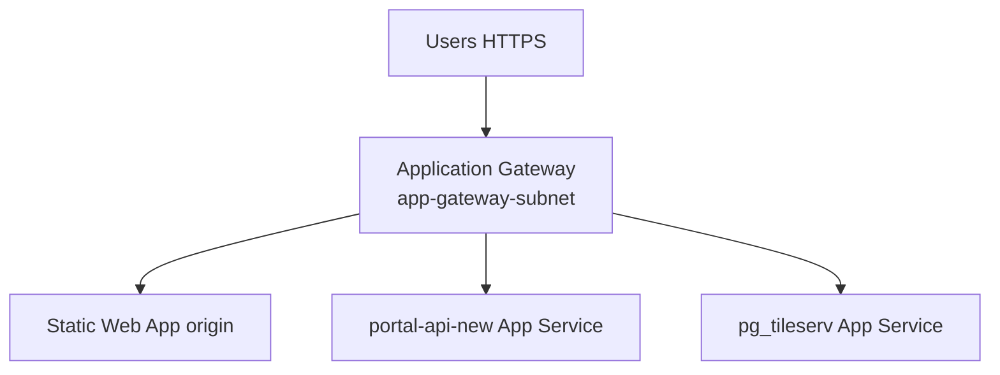

# 08c — Azure Tier 2 Reference (TDIS Production Parity)

**Audience:** Azure / network / security leads — **not** the first deploy walkthrough.

For step-by-step junior instructions, use **[08-deploy-to-azure-by-hand.md](08-deploy-to-azure-by-hand.md)** (Tier 1). This chapter documents how **TDIS production** differs so your team can align when required.

---

## When to use Tier 2

| Trigger | Action |
|---------|--------|
| Portal works on Tier 1, no security mandate | Stay on Tier 1 until needed |
| Security requires **no public PostgreSQL** | Tier 2 — private PG + VNet integration |
| Custom domains + single TLS entry point | Tier 2 — Application Gateway |
| Compliance audit requires TDIS architecture match | Tier 2 — full checklist below |

> **Do not** start here on day one. Application Gateway + VNet integration is significantly harder than Tier 1 and often needs an experienced Azure engineer.

---

## Tier 1 vs Tier 2 summary

| | Tier 1 (ch. 08) | Tier 2 (this chapter) |
|---|-----------------|------------------------|
| VNet / subnets | Not used | Required |
| PostgreSQL | Public hostname + firewall | Private endpoint or VNet-integrated Flexible Server |
| App Service ingress | `*.azurewebsites.net` | VNet integration + optional App Gateway |
| Application Gateway | Skip | Dedicated `app-gateway-subnet` |
| Static Web App | Public SWA URL | Same, or origin behind App Gateway |
| Approx. extra cost | — | + ~$150/mo (App Gateway) |

---

## TDIS dev networking layout (reference)

TDIS runs portal App Services inside a shared VNet. Subnet names and CIDRs from TDIS dev (distilled for BIT — no infra repo access):

| Subnet name | CIDR (TDIS dev) | Delegation / use |
|-------------|-----------------|------------------|
| `app-gateway-subnet` | 10.0.1.0/24 | **Application Gateway only** — cannot share with other resources |
| `app-services-subnet` | 10.0.2.0/24 | Delegated to `Microsoft.Web/serverFarms` — App Service regional VNet integration |
| `postgres-subnet` | 10.0.6.0/24 | Private PostgreSQL Flexible Server |
| VNet | `tdis-dev-vnet` — 10.0.0.0/16 | Container for all subnets |

Portal-specific App Services using VNet integration in TDIS:
- **portal-api-new** (FastAPI)
- **portal-postgres-tile** (pg_tileserv)

Both set `subnet_id` = `app-services-subnet` and connect to Application Gateway via `app-gateway-subnet`.

---

## TDIS production hostname map (dev examples)

| Role | Hostname |
|------|----------|
| Frontend | `portal.dev.cloud.tdis.io` |
| FastAPI | `api-new-portal.dev.cloud.tdis.io` |
| Email API | `api-portal.dev.cloud.tdis.io` |
| pg_tileserv | `portal-pgtile.dev.cloud.tdis.io` |
| PostgreSQL | Internal — credentials in Key Vault |

Application Gateway terminates TLS and routes to backend pools (SWA origin, API App Service, pg_tileserv App Service).

---

## Tier 2 resource checklist

Work with your Azure/network team to create:

| # | Resource | Notes |
|---|----------|-------|
| 1 | **Virtual Network** | e.g. 10.0.0.0/16 — use org-standard CIDR if different |
| 2 | **`app-gateway-subnet`** | Minimum /24; no other resources in this subnet |
| 3 | **`app-services-subnet`** | Delegate to `Microsoft.Web/serverFarms`; enable regional VNet integration on App Services |
| 4 | **`postgres-subnet`** | For private PostgreSQL Flexible Server |
| 5 | **Private DNS zone** | For PostgreSQL private link (if used) |
| 6 | **PostgreSQL Flexible Server** | Disable public access; place in VNet or use private endpoint |
| 7 | **Application Gateway** | WAF optional; backend pools for API, tiles, SWA |
| 8 | **Key Vault** | Same as Tier 1; consider private endpoint in hardened env |
| 9 | **App Services** | API, pg_tileserv, email — VNet integrated |
| 10 | **Static Web App** | Frontend; configure as App Gateway backend or custom domain |
| 11 | **ACR** | Same as Tier 1 |
| 12 | **NSG rules** | TDIS restricts outbound from `app-services-subnet` (Key Vault, PostgreSQL `Sql` tag, HTTPS) |

---

## Application Gateway — what it fronts

In TDIS, one Application Gateway routes traffic to multiple backends:

Each backend needs:
- **Backend pool** — FQDN of App Service or SWA
- **Health probe** — API: `/api/v1/health/liveness`; tiles: `/health`
- **HTTP settings** — HTTPS to backend, host header override if needed
- **Listener + routing rule** — hostname → backend (e.g. `api-new-portal.dev.cloud.tdis.io` → API pool)

[Screenshot: Application Gateway → Backend pools → Add backend pool]

---

## Migrating Tier 1 → Tier 2 (high level)

1. Create VNet + subnets (do not delete Tier 1 resources until cutover tested).  
2. Provision private PostgreSQL; migrate schema/data from Tier 1 server.  
3. Enable VNet integration on App Services; update `DATABASE_*` / `DATABASE_URL` to private hostname.  
4. Deploy Application Gateway; configure TLS cert (Key Vault or uploaded PFX).  
5. Update frontend build: `VITE_API_URL`, `VITE_TILE_SERVER_BASE_URL` to custom hostnames.  
6. Update API `BACKEND_CORS_ORIGINS` to new frontend URL.  
7. Decommission Tier 1 public PostgreSQL firewall rules when no longer needed.

---

## NSG considerations (TDIS pattern)

TDIS `app-services-subnet` NSG allows outbound:
- HTTPS (443) — general API calls  
- `AzureKeyVault` service tag — secret retrieval  
- `Sql` service tag on port 5432 — PostgreSQL  
- VirtualNetwork — east-west within VNet  

Default deny on other outbound. Your security team may require similar rules.

---

## What this manual does not include

- Full copy-paste Tier 2 deploy commands (too environment-specific)  
- TDIS Terragrunt / Terraform modules  
- Firewall or Azure Front Door configuration  

Engage your Azure team or TDIS for hands-on Tier 2 implementation support.

---

## Related chapters

- [02-architecture.md](02-architecture.md) — three deployment diagrams  
- [08b-azure-resource-checklist.md](08b-azure-resource-checklist.md) — Tier 1 required list  
- [08-deploy-to-azure-by-hand.md](08-deploy-to-azure-by-hand.md) — Tier 1 walkthrough  
- [12-troubleshooting-faq.md](12-troubleshooting-faq.md) — common errors
